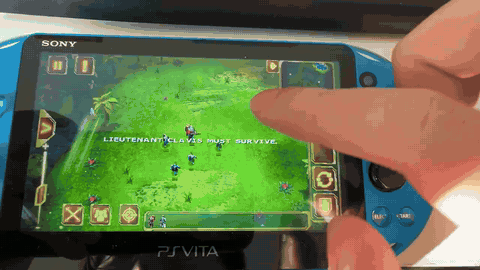

> **本项目使用 AI 生成。** 感谢所有前人的 Vita 移植项目，你们的工作为 AI 完成本项目提供了重要参考。

# Starfront: Collision HD · PS Vita Loader

[**下载 VPK**](https://github.com/vctorwei/starfront-vita/releases/tag/v0.0.6-r1) · [安装教程](#安装教程) · [真机演示](#真机演示) · [English / Credits](README.md#credits)

[](https://x.com/gameloft/status/964888517984837637)

*图片外链自 [Gameloft 的公开帖子](https://x.com/gameloft/status/964888517984837637)，版权归 Gameloft；是原版游戏宣传图，不代表当前 PSV 版本画面。*

本项目是 **Starfront: Collision HD Android 1.0.0 的加载器（loader）**，基于 TheFloW 的 Android SO loader，提供运行原版 ARMv7 游戏所需的 Android 兼容接口。玩家需自备 **1.0.0 APK 和配套 OBB / 游戏数据**。

**00.06-r1 是基于 00.06 的开发测试版**，将原版资源从 VPK 中分离，并公开加载器源码。本次修改后的版本尚未经真机测试，完整战役稳定性也仍待验证。

## 免责声明

Starfront: Collision HD © 2011 Gameloft。游戏及相关名称、美术和商标归各自权利人所有。本项目为非官方项目，未经 Gameloft 或 Sony 制作、授权或认可。

加载器发布包不包含原版游戏执行文件、APK、OBB 或提取的游戏资源。玩家必须自行提供合法取得的游戏副本；项目作者不支持或鼓励盗版。宣传截图和实机演示中的游戏内容仍受原权利人的版权约束。

## 安装教程

1. 安装 [kubridge](https://github.com/bythos14/kubridge)：将 `kubridge.skprx` 放入 `ur0:tai/`，在 `ur0:tai/config.txt` 的 `*KERNEL` 下添加以下配置，然后重启：

   ```text
   *KERNEL
   ur0:tai/kubridge.skprx
   ```

2. 确认 `ur0:data/` 中有 `libshacccg.suprx`；缺少时参见 [ShaRKBR33D](https://github.com/Rinnegatamante/ShaRKBR33D)。
3. 下载并解压 Release 中的 **Source code (zip)**，安装 [Python 3.9+](https://www.python.org/downloads/)。在解压的文件夹里，用自己的 Android 1.0.0 文件运行：

   ```sh
   python3 scripts/prepare_game.py --apk "Starfront.apk" --data "GloftSFHP" --output "prepared/starfront"
   ```

   Windows 将 `python3` 换为 `py -3`。`--data` 可以是解包后的 `GloftSFHP` 文件夹，也可以是 ZIP 格式的 OBB / 数据压缩包。脚本会校验 APK 并在本机准备资源，不下载游戏文件。
4. 将生成的 `starfront` 文件夹复制到 `ux0:data/starfront/`。**更新时保留已有存档，不要覆盖已有的 `data.save` 文件。**
5. 用 [VitaShell](https://github.com/TheOfficialFloW/VitaShell) 安装 [VPK](https://github.com/vctorwei/starfront-vita/releases/tag/v0.0.6-r1)，打开 **Starfront Test**，检查通过后自动进入游戏，无需按 **×**。

**从 00.06 更新：** 仍需运行一次准备脚本，补上新增的 `apk/igli.bin` 和 `apk/serialkey.txt`，再覆盖安装 VPK。继续使用 1024×600 整体缩放至 960×544，关闭文件日志。

## 操作

前触屏操作，支持双指框选。**START** 返回，**SELECT + START** 退出。暂不支持完整按键操作。

## 真机演示

维护者录制的旧 00.06 版 PSV 真机录像，不代表 00.06-r1 已通过真机验证。点击查看带声音的视频。

[](media/demo.mp4)

## 致谢与许可证

感谢所有前人的移植与工具项目。完整贡献者名单及 GTA SA、Backstab、MC3、MC2、Gun Bros 等参考项目链接见 [Credits](README.md#credits)。

原创部分使用 **MIT**；包含 GPL/LGPL 依赖的完整加载器二进制按 **GPLv3** 发布。详见 [许可范围](LICENSE.md)、[第三方说明](THIRD_PARTY.md) 和 [编译说明](docs/BUILD.md)。
